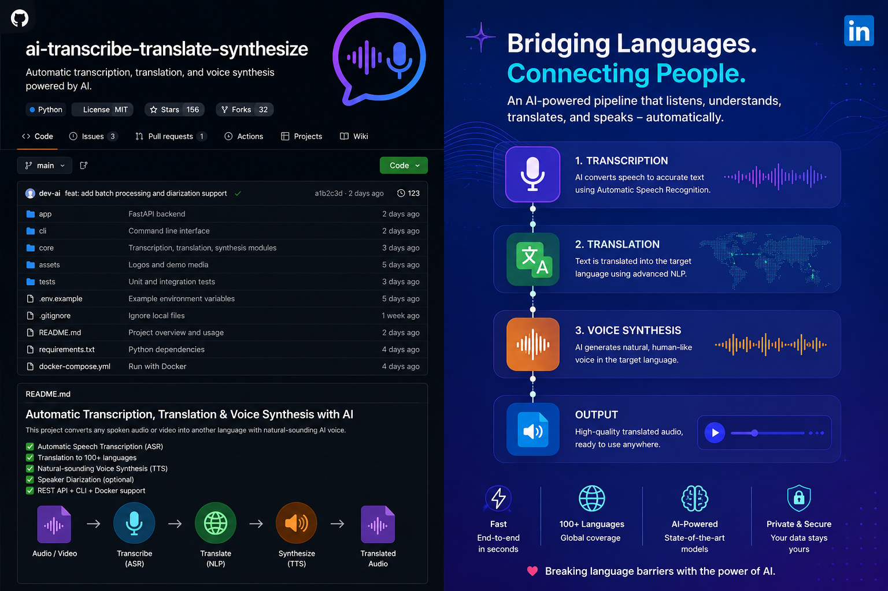

# 本地实时字幕

在 Windows 上把电脑正在播放的声音转换成文字，再翻译成字幕并显示在 Chrome 视频页面上。

适合观看 YouTube、网课、直播回放等没有中文字幕的视频。语音识别与翻译均在本机完成。



## 普通用户先看

| 你关心的问题 | 结论 |
| --- | --- |
| 最低配置是什么？ | Windows 10/11、Chrome、NVIDIA 显卡和 8 GB 内存可运行；16 GB 内存、6 GB 及以上显存体验更稳。没有 NVIDIA 显卡不适合使用这套当前配置。 |
| 会上传我的视频、声音或字幕吗？ | 不会。声音在本机默认播放设备中采集，语音识别、翻译、字幕服务都只监听 `127.0.0.1`，不会主动上传内容。 |
| 需要联网吗？ | 日常使用不需要。首次准备模型和软件时需要联网下载；之后可在断网状态下使用。 |
| 要付费或填 API Key 吗？ | 当前本机 Whisper + Hy-MT2 方案不需要 API Key，也没有按次费用。 |
| 需要多大磁盘空间？ | 建议预留至少 10 GB：模型、运行组件和 Python 环境都放在项目目录。 |
| 字幕会立刻出现吗？ | 不会。为了听完整一句话，通常会比声音晚约 2～4 秒；质量模式会更慢一些。 |
| 第一次启动要等多久？ | 模型需要加载，通常等待几十秒；之后每次启动仍需等待模型就绪。 |
| 会影响电脑其他使用吗？ | 会占用 NVIDIA 显卡、内存和少量 CPU。看视频时尽量不要同时运行游戏、渲染或大型 AI 软件。 |
| 能翻译所有网站吗？ | Chrome 扩展可在大多数普通视频页面显示字幕；受版权保护的页面、特殊播放器或浏览器限制页面可能无法注入字幕。 |
| 能直接翻译视频自带字幕吗？ | 不能。本项目听的是播放出来的声音，再生成自己的实时字幕。 |
| 能识别麦克风吗？ | 当前默认不识别麦克风，只识别电脑正在播放的声音。 |

隐私说明：项目里的 `logs` 只保存在本机，用于排错；GitHub 仓库也已排除模型、日志、运行组件、备份和虚拟环境。除非你主动把日志或配置发给别人，否则它们不会离开你的电脑。

## 直接使用

首次使用只需把 Chrome 扩展加载一次：

1. 在 Chrome 地址栏打开 `chrome://extensions`。
2. 打开右上角的“开发者模式”。
3. 点击“加载已解压的扩展程序”。
4. 选择本项目中的 `extension` 文件夹。
5. 固定扩展图标，方便查看连接状态和修改设置。

之后看视频时：

1. 双击 `启动-流畅模式.cmd`，等待提示启动完成。
2. 打开或刷新视频页面并播放视频。
3. 点击扩展图标；右上角圆点变绿，表示已连接。字幕会显示在视频页面底部。
4. 用完后双击 `停止字幕.cmd`。

启动后，直接双击另一种模式即可切换，不必先手动停止。

## 两种模式怎么选

| 适用场景 | 双击哪个文件 | 特点 |
| --- | --- | --- |
| 日常视频、访谈、语速正常的内容 | `启动-流畅模式.cmd` | 响应更快，电脑压力较小。 |
| 课程、长句、嘈杂音频、想要更稳的识别 | `启动-质量模式.cmd` | 字幕会稍慢一点，显卡占用更高。 |

两种模式都使用本机 Whisper 语音识别和 Hy-MT2 翻译。流畅模式使用较短的声音片段；质量模式识别得更仔细，等待时间也略长。

## 在扩展里改设置

点击 Chrome 工具栏中的“本地实时字幕”图标，可以直接改：

- **源语言**：建议明确选择英语、日语、韩语等；不确定时选“自动识别”。明确选择通常更稳定。
- **翻译为**：默认是简体中文。
- **显示字幕**：临时隐藏或恢复字幕，不需要重启服务。
- **同时显示原文**：适合学语言；开启后会同时看到识别出的原文和中文。
- **字幕字号、位置**：按自己屏幕调整。

改完必须点击“应用设置”。

## 声音设置很重要

工具听的是 **Windows 当前默认播放设备** 中的声音，不是麦克风。

- 视频声音必须从当前默认的音箱、耳机或显示器扬声器播放。
- 更换耳机、蓝牙设备或显示器后，如果突然没有字幕，先关闭字幕服务，再重新启动。
- 播放音量不宜太小。建议把视频和系统音量调到能正常听清的程度；声音失真或过小都会影响识别。
- 笔记本建议接通电源，并在显卡设置中使用高性能模式。
- 当前版本会听到默认设备上的所有声音。若同时播放游戏、聊天提示音或其他视频，它们也可能被识别；使用时尽量只播放目标视频。

## 想微调模式参数

日常使用只需使用两个 CMD 文件。需要微调时，修改对应配置文件，然后停止并重新启动服务：

| 文件 | 管理内容 | 常用调整 |
| --- | --- | --- |
| `config.flow.json` | 流畅模式 | 调整源语言、字幕响应速度。 |
| `config.quality.json` | 质量模式 | 调整源语言、识别精度和较长句的稳定性。 |

常见字段：

- `translation.source_language`：如 `English`、`Japanese`、`Korean`；留空可自动识别。
- `translation.target_language`：例如 `简体中文`、`繁体中文`、`English`。
- `audio.chunk_duration_seconds`：每次处理的声音长度。更短会更快，但上下文较少；更长会更稳，但字幕更晚出现。
- `audio.overlap_seconds`：相邻两段声音重叠的时长。用于减少词语被切断，不建议轻易设为 0。
- `stt.whisper_local.beam_size`：语音识别的仔细程度。数值越大通常越稳，但更占显卡。

建议一次只改一个字段，并先在流畅模式测试。两个配置文件中可保留不同的源语言，但扩展弹窗里的设置会在当前运行时生效。

## 项目文件说明

```text
启动-流畅模式.cmd        日常启动入口
启动-质量模式.cmd        高质量启动入口
停止字幕.cmd             正常停止入口
config.flow.json         流畅模式配置
config.quality.json      质量模式配置
extension/               Chrome 扩展和字幕页面样式
service/                 声音采集、语音识别、翻译和字幕推送
logs/                    运行记录；遇到问题先看这里
models/                  本机模型文件，不会上传到 GitHub
runtime/                 本机翻译运行组件，不会上传到 GitHub
backups/                 每次重要修改前留下的可恢复备份
```

## 给准备改进项目的人

请先在自己的分支上改，不要直接修改正在使用的部署。最稳妥的顺序是：

1. 先运行一次流畅模式和质量模式，确认原始版本能正常显示字幕。
2. 只改一个功能点，例如字幕样式、识别策略或翻译提示语。
3. 每次修改后都做完整测试：启动 → 播放视频确认字幕出现 → 停止 → 再次启动 → 再确认字幕出现。
4. 两种模式都通过后，再提交代码。

常用改进位置：

| 想改什么 | 从这里开始 |
| --- | --- |
| 字幕位置、字体、颜色、原文显示 | `extension/content.js`、`extension/styles.css`、`extension/popup.*` |
| 扩展连接和自动重连 | `extension/background.js` |
| 声音采集、分段和重复字幕处理 | `service/audio_capture.py`、`service/pipeline.py` |
| 本机 Whisper 识别策略 | `service/engines/stt/whisper_local.py` |
| Hy-MT2 翻译提示语、上下文与输出清理 | `service/engines/translation/llama_cpp.py` |
| 启动、停止、模式切换与后台守护 | `launch.ps1`、`start.ps1`、`stop.ps1`、`service-host.ps1` |

### 修改时必须遵守的约定

- 不要把 `models/`、`runtime/`、`.venv/`、`logs/`、`backups/` 提交到 GitHub；它们是本机文件，已经写入 `.gitignore`。
- 不要提交真实 API Key、令牌或个人设备名称。若新增配置项，优先在 `config.json.example` 里提供空白示例。
- 端口 `8765` 用于字幕服务，`8766` 用于本机翻译模型。修改前先确认不会和其他程序冲突。
- 启动和停止逻辑要配套修改。只让“能启动”通过是不够的，必须验证停止后能再次启动。
- 修改 PowerShell 或 CMD 文件后，至少手动双击测试一次。中文脚本要继续使用 PowerShell 7，避免旧版 PowerShell 的编码问题。

## 常见问题与处理

| 现象 | 先这样处理 |
| --- | --- |
| 扩展显示“未加载服务”或圆点是红色 | 双击一种启动脚本，等启动完成；回到视频页刷新一次。 |
| 重启 Chrome 后又连不上 | Chrome 关闭不会自动启动字幕服务。重新双击启动脚本即可。 |
| 双击启动后一直没有字幕 | 确认视频正在播放、声音从 Windows 默认播放设备输出；再在扩展中确认“显示字幕”已勾选。 |
| 更换耳机或蓝牙音箱后没有字幕 | 停止字幕服务，确认新设备是 Windows 默认播放设备，再重新启动。 |
| 启动时提示模型或字幕服务加载超时 | 打开 `logs` 文件夹，优先查看 `llama.err.log` 和 `subtitle.err.log` 最后的内容；确认 `models`、`runtime` 和 `.venv` 文件夹仍在项目根目录。 |
| 扩展错误页反复出现 WebSocket 连接失败 | 这表示扩展正在重连，而本地服务尚未启动或刚刚停止。启动完成后它会自行恢复；已停止服务时可忽略。 |
| 运行停止脚本后字幕还在 | 再运行一次 `停止字幕.cmd`；若仍存在，检查 `logs` 文件夹，记录端口 8765 或 8766 的占用信息后提交问题。 |
| 停止后无法重新启动 | 使用项目根目录的最新版 `启动-流畅模式.cmd` 或 `启动-质量模式.cmd`。不要直接运行旧的 `start.ps1` 或手动结束随机 Python 进程。 |
| 翻译前面偶尔出现“当前字幕：” | 已在翻译输出中自动移除。如果仍出现，请保留对应时间的 `logs` 并提交问题。 |
| 识别或翻译不够准 | 先选择正确的源语言、适当提高播放音量，并切换到质量模式。实时字幕会分段处理，句子尚未说完时出现轻微不完整是正常现象。 |

## 从 GitHub 获取源码后的说明

GitHub 仓库只保存代码、配置示例和扩展；大模型、Python 虚拟环境、运行组件、日志和备份均未上传。因此，直接克隆仓库后不能立刻双击运行。

要重新部署，需要自行准备：Windows、PowerShell 7、Python 虚拟环境与 `requirements.txt` 依赖、CUDA 版 llama.cpp 运行组件，以及两个 Hy-MT2 GGUF 模型文件。准备完成后，文件位置需与本 README 的“项目文件说明”一致，再加载 `extension` 文件夹并使用两个启动脚本测试。

## 提交问题时请附上这些信息

为了让别人能复现和修复问题，请说明：

- 使用的是流畅模式还是质量模式；
- 视频的语言、网站和大概出现问题的时间点；
- 扩展圆点的颜色，以及 Chrome 扩展错误页中的完整错误；
- `logs/llama.err.log`、`logs/subtitle.err.log` 或 `logs/host.log` 最后约 30 行；
- 是否刚更换过耳机、蓝牙设备或视频输出设备。

不要把个人账号、完整视频隐私链接、API Key 或本机私人文件上传到问题区。

## 许可证

MIT
